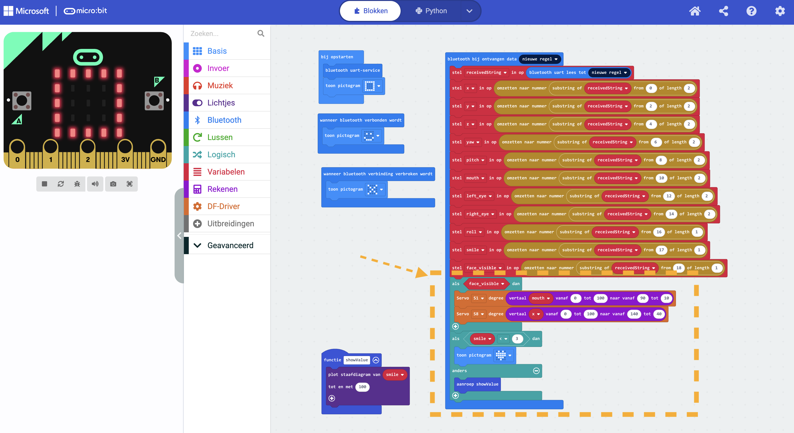

# Voorbereiding (10 min) #

**Helaas werken de webpagina's die we gebruiken alleen in Chrome of Edge**

---
- Plaats de micro:bit in het extension-board: buttons en leds van de micro:bit wijzen naar buiten

- Sluit een servo aan op de pinnen bij s1 op het extension board, let op de orientatie: zwart of bruine draad hoort bij GND

- Sluit de voedingskabel (dc-barrel-jack naar usb ) aan op het extension-board en een telefoonlader/laptop

- Sluit de micro:bit aan met de USB-kabel op je laptop/chromebook

- Open de [makecode editor](https://makecode.microbit.org/) in edge of chrome en maak een project aan  
Volg even eventueel de [officiële tutorial](https://microbit.org/nl/get-started/getting-started/get-coding/?device=computer) om kennis te maken met makecode en de microbit
---

- klik op extensions,

- vul in de zoekbalk https://github.com/DFRobot/pxt-motor in en klik op het vergrootglas

- klik dan op de tegel met de titel Motor. Er verschijnt dan een cateforie DFRobot in de balk links.

- gebruik een **input** blok als trigger om een servo in een bepaalde stand de zit. bijv: [wanneer knop A ingedrukt wordt]

- of maak een loop, met pauzes!, die de servo in verschillende standen zet.

---
# Bouw je Robot #

- Snij en vouw volgens de lijnen van het template of gebruik een lasersnijder. Rood is snijden, blauw is vouwen.

- Gebruik m3 boutjes en moeren of nietjes om delen te verbinden.

- Plaats de servo's in je robot.  
In het hoofd plaats je de servo vanaf de binnenkant en leid je het kabeltje naar buiten.  
Voor de basis plaats je de servo vanaf de buitenkant en leid je het kabeltje naar binnen.  

`Wacht nog even met het in je robot plaatsen van de microbit en het expansion bord omdat je de usb-kabel niet aan de microbit verbonden kunt hebben als deze in de robot zit.`  

---  

# Laat je Robot bewegen #

- Gebruik blokjes om de servo's te bewegen op basis van input die je kiest (knoppen/microfoon/licht)  
   

---
# Gebruik Computer Vision om je Robot te laten bewegen
Op de frontpage van makecode.microbit.org importeer je een project vanaf een url
- klik op de import knop rechts

- klik op import url
- vul onderstaande volgende url in en klik op *Go ahead!*  
https://github.com/werkplaatsenpabobreda/face-tracking-app-v2---sample-code
- doe iets met de servo op basis van de waarden die je binnen krijgt   

  

- open in een andere tab de volgende url:   
https://frobel.gepatto.nl/face

- klik op het robotje en verbind met de micro:bit (bluetooth verbinding!)

# Achtergrond info
- webapp is een mediapipe model dat in WebAssembly draait en dat door p5js gevisualiseerd wordt.  

- waarden worden als string via uart over bluetooth naar de microbit gestuurd.
